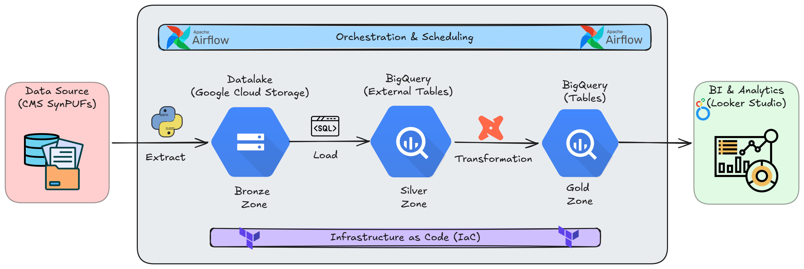
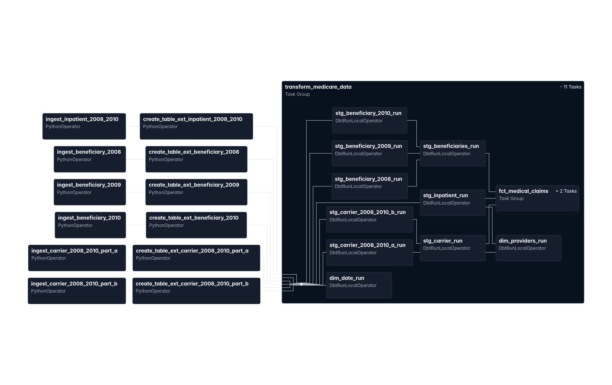
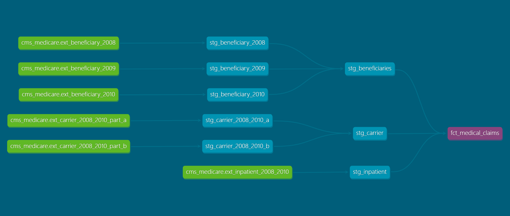
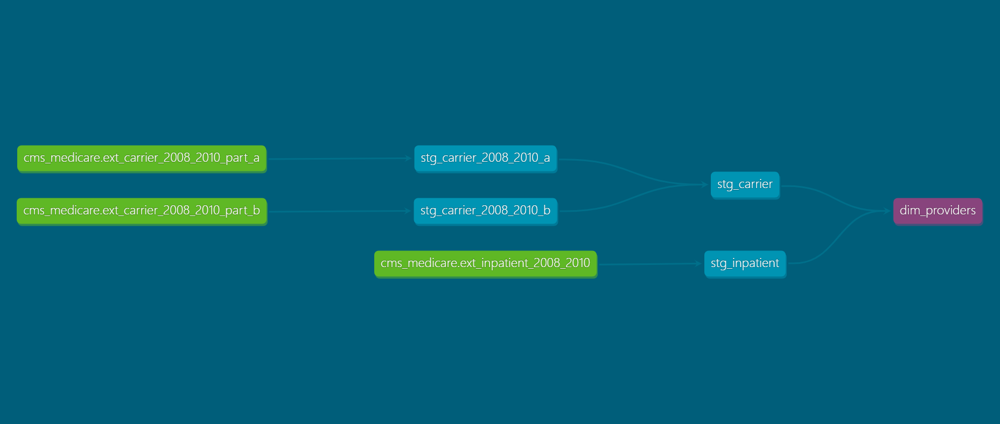
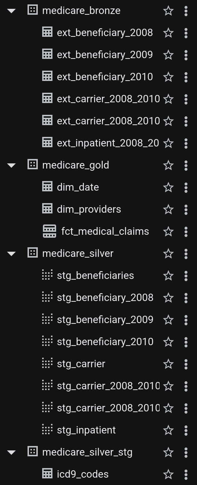

# Medicare Provider Intelligence Hub



[](https://www.python.org/downloads)
[](https://airflow.apache.org)
[](https://www.getdbt.com)
[](https://www.docker.com)
[](https://www.terraform.io)
[](https://cloud.google.com/bigquery)
[](https://cloud.google.com/storage)
[](https://lookerstudio.google.com)

## Table of Contents
---
1. [Problem Statement](#-problem-statement)
2. [Dataset](#-dataset)
3. [Solution Overview](#-solution-overview)
4. [Tech Stack](#️-tech-stack)
5. [Architecture & Pipeline](#-architecture--pipeline)
6. [Data Modeling](#-data-modeling)
7. [Dashboard & Key Questions Answered](#-dashboard--key-questions-answered)
8. [Setup & Reproduction](#️-setup--reproduction)

---

## 🏥 Problem Statement

Medicare is one of the largest public healthcare programs in the world, spending hundreds of billions of dollars annually on medical claims. Yet the raw data produced by this system is notoriously difficult to work with — cryptic column names, fragmented files split across years, and no unified analytical layer.

**This project tackles three core questions that healthcare administrators and policy-makers care deeply about:**

- Where is Medicare spending concentrated geographically?
- Which diagnoses are driving the highest reimbursement costs?
- How are patient out-of-pocket costs trending over time, and how does patient age factor in?

Without a structured pipeline, answering these questions requires painful ad-hoc analysis every time. This project solves that by building a **fully automated, end-to-end batch ELT pipeline** on Google Cloud Platform that transforms raw CMS files into a clean, queryable analytical layer — ready for a BI dashboard in minutes.

---

## 📂 Dataset

This project uses the **CMS Medicare Synthetic Public Use Files (SynPUF)** — a realistic but fully synthetic dataset published by the Centers for Medicare & Medicaid Services (CMS). The data is structured to mirror real Medicare claims without containing any actual patient information.

| Resource | Link |
| :--- | :--- |
| Dataset Homepage | [CMS SynPUF Overview](https://www.cms.gov/data-research/statistics-trends-and-reports/medicare-claims-synthetic-public-use-files) |
| Data User Guide (PDF) | [SynPUF Data User Guide](https://www.cms.gov/research-statistics-data-and-systems/downloadable-public-use-files/synpufs/downloads/synpuf_dug.pdf) |

**Three datasets were used, covering the years 2008–2010 (Sample 1):**

| Dataset | Description |
| :--- | :--- |
| **Beneficiary Summary** | Patient demographics, chronic conditions, and enrollment data (one file per year: 2008, 2009, 2010) |
| **Inpatient Claims** | Hospital admission records including diagnosis codes, procedure codes, and payment amounts |
| **Carrier Claims** | Physician and outpatient service claims, split into two parts (A & B) for the full 2008–2010 window |

---

## 💡 Solution Overview

The raw SynPUF files are inconsistently named, split across multiple zip archives, and full of abbreviated CMS column headers that have no business meaning without the data dictionary. The solution is a **Medallion Architecture pipeline** on GCP:

- **Bronze:** Raw CSV files are downloaded directly from CMS.gov, extracted from their zip archives, and landed in **Google Cloud Storage** — untouched, preserving the source of truth.
- **Silver:** Apache Airflow triggers **dbt** (via Astronomer Cosmos) to create **external tables** in BigQuery pointing at the GCS files, then runs staging models that rename cryptic headers to readable business names and union multi-year beneficiary data.
- **Gold:** dbt produces a production-ready **`fct_medical_claims`** fact table and a **`dim_providers`** dimension table, ready for BI consumption.

---

## 🛠️ Tech Stack

| Category | Tool |
| :--- | :--- |
| **Cloud Provider** | Google Cloud Platform (GCP) |
| **Infrastructure as Code** | Terraform |
| **Orchestration** | Apache Airflow (Dockerized) |
| **dbt Integration** | Astronomer Cosmos (`DbtTaskGroup`) |
| **Data Lake** | Google Cloud Storage (GCS) |
| **Data Warehouse** | BigQuery |
| **Transformation** | dbt (data build tool) |
| **Visualization** | Looker Studio (Google Data Studio) |
| **Language** | Python, SQL |

---

## 📐 Architecture & Pipeline

The pipeline follows a modern **ELT** pattern — load raw data first, then transform inside the warehouse.


### Step-by-step flow

**1. Provision Infrastructure (Terraform)**
Running `terraform apply` creates:
- A GCS bucket (`medicare_bronze`) as the raw data lake
- Three BigQuery datasets: `medicare_bronze`, `medicare_silver`, and `medicare_gold`

**2. Ingest (Airflow — `PythonOperator`)**
A scheduled Airflow DAG downloads each SynPUF zip file from CMS.gov, extracts the CSV in-memory, and streams it directly into GCS — no local disk required. Six source files are ingested in total:
- `beneficiary_2008`, `beneficiary_2009`, `beneficiary_2010`
- `inpatient_2008_2010`
- `carrier_2008_2010_part_a`, `carrier_2008_2010_part_b`

**3. Load → External Tables (Airflow — `PythonOperator`)**
After each file lands in GCS, a corresponding BigQuery **external table** is created in `medicare_bronze`, pointing directly at the raw CSV. No data is moved — BigQuery reads it in place.

**4. Transform (Airflow — `DbtTaskGroup` via Astronomer Cosmos)**
The same DAG then triggers dbt models in dependency order:



---

## 📊 Data Modeling

All dbt models follow the Medallion pattern:

**Silver Layer (Staging)**
| Model | Description |
| :--- | :--- |
| `stg_beneficiary_2008/2009/2010` | Per-year beneficiary snapshots with human-readable column names |
| `stg_beneficiaries` | Union of all three years into a single beneficiary spine |
| `stg_carrier_2008_2010_a/b` | Part A and Part B carrier claims, renamed and typed |
| `stg_carrier` | Union of carrier parts into a single carrier claims table |
| `stg_inpatient` | Inpatient claims with standardized columns |

**Gold Layer (Marts)**
| Model | Description |
| :--- | :--- |
| `fct_medical_claims` | Central fact table joining beneficiaries, carrier, and inpatient claims |
| `dim_providers` | Provider dimension derived from carrier and inpatient data |
| `dim_date` | Date dimension for time-series analytics |

**dbt Lineage — `fct_medical_claims`**


**dbt Lineage — `dim_providers`**


**BigQuery Datasets**



---

## 📈 Dashboard & Key Questions Answered

The final `fct_medical_claims` table was connected to **Looker Studio** to answer four key business questions:

[](https://datastudio.google.com/s/r_3pSPVoPl8)

<span style="color:green">**Click on the above GIF to visit dashboard.**</span>

| Question | Visualization | Insight |
| :--- | :--- | :--- |
| **Where is the money going?** | US choropleth map of `medicare_payment_amt` by state | Identifies geographic hotspots with Medicare spending ranging from ~$994K to $72.5M by state |
| **Which conditions are most expensive?** | Bar chart of average `medicare_payment_amt` by ICD-9 diagnosis code | Specific diagnosis (e.g. `TB OF VERTEBRA-UNSPEC`) emerge as significantly higher-cost events |
| **How are patient costs trending?** | Time-series line chart of `total_patient_cost` from 2008–2010 | Reveals a peak in mid-2009 followed by a gradual decline through 2010 |
| **How does age affect claim cost?** | Scatter plot of `patient_age_at_claim` vs. `total_patient_cost` | Most claims cluster in the 80–85 age range; extreme costs appear as isolated outliers in that band |

---

## ⚙️ Setup & Reproduction

### Prerequisites
- A GCP project with billing enabled
- A GCP service account key saved as `gcp-creds.json` in the project root
- Terraform ≥ 1.0, Docker, and Docker Compose installed

### 1. Provision Infrastructure

```bash
cd terraform
terraform init
terraform apply
```

This creates the GCS bucket and BigQuery datasets.

### 2. Configure Airflow

```bash
cd orchestration
```

Create a `.env` file (or copy from the example) with:

```env
AIRFLOW_VAR_GCP_PROJECT_ID=your-gcp-project-id
AIRFLOW_VAR_GCS_BUCKET=your-bucket-name
AIRFLOW_VAR_BRONZE_DATASET_NAME=medicare_bronze
```

Mount your `gcp-creds.json` into the Airflow container (already configured in `docker-compose.yaml`).

Set up a BigQuery connection in Airflow named `db_bq_conn` using the service account key.

### 3. Start Airflow

```bash
docker compose up -d
```

Navigate to `http://localhost:8080`, then trigger the `medicare_pipeline` DAG.

The DAG will:
1. Download and ingest all six source files to GCS
2. Create external tables in `medicare_bronze`
3. Run all dbt models to populate `medicare_silver` and `medicare_gold`

### 4. Connect to Looker Studio

Point Looker Studio at the `medicare_gold.fct_medical_claims` BigQuery table to build your own dashboard.

